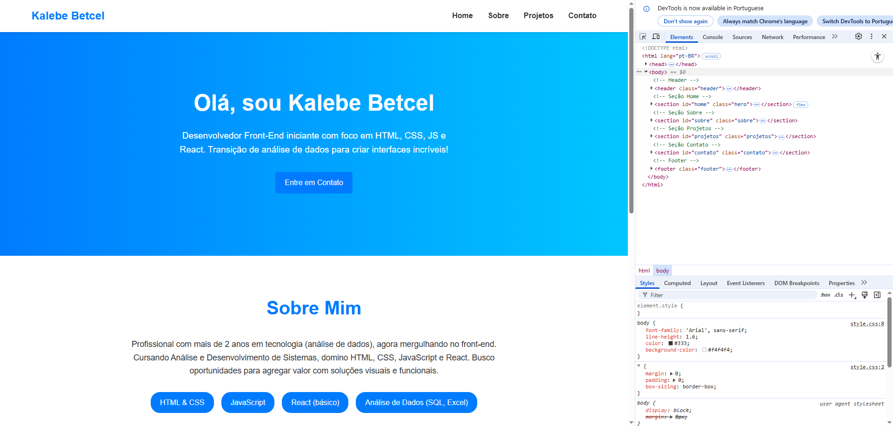

# Meu Portfólio Front-End

## Descrição
Landing page pessoal responsiva construída com HTML e CSS puro. Este é meu primeiro projeto como desenvolvedor front-end iniciante, focando em criar interfaces clean e funcionais. Ideal para demonstrar habilidades básicas em web development.

## Tecnologias Usadas
- **HTML5**: Estrutura semântica (header, sections, footer).
- **CSS3**: Layout com Flexbox e Grid, animações suaves, responsividade com media queries.
- **Outros**: Design mobile-first, sem JavaScript (para manter simples).

## Como Executar
1. Clone o repositório: `git clone https://github.com/seuusuario/portfolio-landing-page.git`
2. Abra o arquivo `index.html` no seu navegador.
3. Para hospedar: Ative GitHub Pages em Settings > Pages.

## Prints ou Demo
 

## Sobre Mim
Sou Kalebe Betcel, com background em análise de dados e agora mergulhando no front-end (HTML, CSS, JS, React). Conecte-se no [LinkedIn](https://linkedin.com/in/kalebebetcel).

Feito em 2024.
